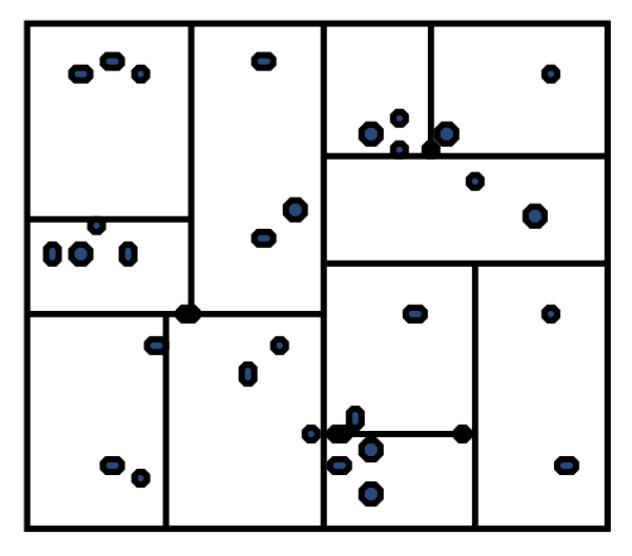
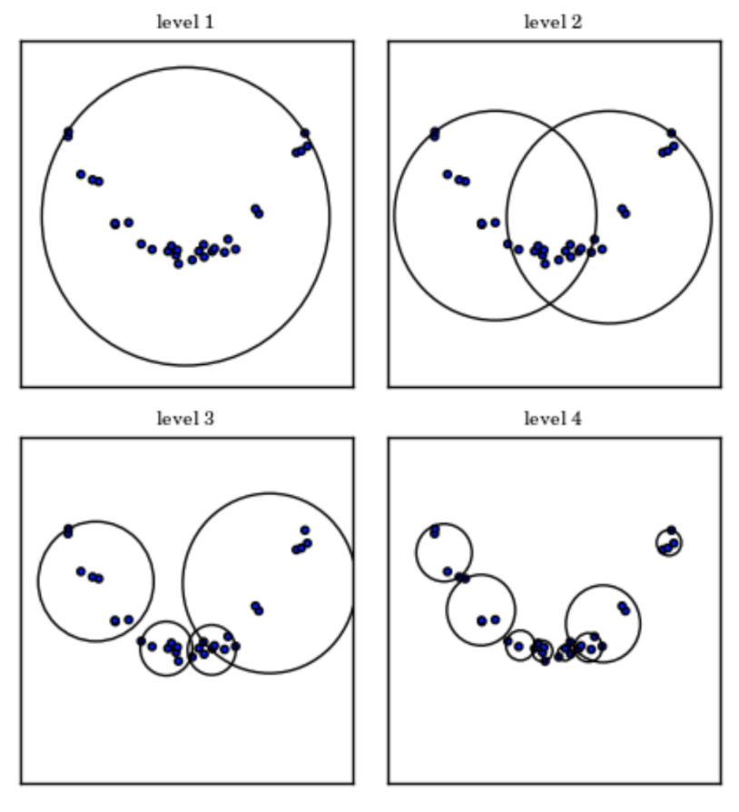

### 一  概览

1. 构造Ball树，然后实现基于Ball树的KNN算法，用Java实现

2. 分析并比较Ball树和KD树方法的特点

3. 讨论以上两种树的数据结构对机器学习的意义和价值


### 二  项目介绍

#### 1  工程结构和运行

```shell
.
├── data # 数据
│   ├── wine.csv
│   ├── wine_norm.csv
│   └── winequality-white.csv
└── src  # 源码
    ├── Ball.java
    ├── BallTree.java
    ├── Center.java
    ├── Instance.java
    ├── KNN.java
    ├── Node.java
    ├── Test.java # 运行入口1
    ├── Test1.java # 运行入口2
    ├── TestK_Label.java
    └── VectorOp.java
```


#### 2  具体实现时的几个细节

（1）根据点集构造最小超球体，参考论文[1]中提到的BC算法构造的近似最小超球体。实际使用中，设置迭代次数为1000，速度较快，计算结果可以接受。

（2）构造按照老师ppt上提供的构造方法，实现KNN是参照维基百科球树[2]搜索部分的伪代码。

（3）总样本数4898，其中重复样本有937。因为这样计算距离的时候是0，我们认为只有自身和自身距离为0，而两条记录哪怕完全相同也是不同个体，因为可能有特征没有观测到，所以只能说距离非常近，接近0。故我们将重复样本的距离设置为一个非零的极小值（0.000001）。


### 三  分析讨论

#### 1  怎么取K值

- 数据集中有类别数目非常小的样本，而K的提高会影响数目少的类别的样本，即使总预测正确率并不太受影响，但是这样的预测结果并不佳。
- 随着K值的增长，预测正确率整体有提高。

- 那么，是不是K值取大就好呢？显然不是。当K值变大，搜索空间增长，搜索时间就也增长，这是我们不希望的。所以，需要在整体准确率的提高和时间的降低之间权衡，选出合适的K值。


#### 2  分析和比较两种树的特点

（1）首先分析两种树的原理

下面两张图分别是二维特征下，kd树和球树的构造结果。虽说都是为了将数据进行分区，从而加速搜索。但是二者还是有些不同。

- 构造时：kd树直接根据某个特征（某个坐标轴）的值来划分空间，球树则需要计算距离来获得超球体从而划分空间。显然构造时，球树要更耗时，因为计算高纬度的距离比直接在坐标轴上划分耗时。

- 找邻居时：球树通过使用三角不等式减少近邻搜索的候选点数，减少搜索空间。通过这种设置, 测试点和质心之间的单一距离计算足以确定距节点内所有点的距离的下限和上限。球树得到的是节点样本组成的最小**超球体**，而KD树得到的是节点样本组成的**超矩形体**，这个超球体要比对应的KD树的超矩形体小，这样在做最近邻搜索的时候，可以避免一些无谓的搜索。

<div align=center></div>


<div align=center></div>

（2）分析适用情况

样本特征维度低于20时，kd树更适合KNN；更高维则选择球树。


####  3  讨论以上两种树的数据结构对机器学习的意义和价值

（1）树结构在KNN算法中的作用

将数据点层次结构化，分配每个节点，并且只需要构造一次，就可以永久提供快速搜索。

（2）机器学习中应用广泛

机器学习中数据往往是高维的，高维意味着各种计算的复杂，如距离计算的复杂，甚至不可行。

并且机器学习中经常使用距离来衡量相似度，如KNN找邻居节点、推荐系统中协同过滤找相似用户等，这些都需要计算距离。

（3）结合（1）和（2），我们可以得到一些启示

一些为高维数据设计的树结构，一次构造，提供多次快速搜索，可以在用到搜索的机器学习算法中使用。作为辅助搜索的数据结构，加快搜索，特别适用于KNN。


###  参考文献

[1] “Ball tree,” *Wikipedia*. 10-Dec-2017.

[2] “(PDF) A note on kernelizing the smallest enclosing ball for machine learning.” [Online]. Available: https://www.researchgate.net/publication/331342591_A_note_on_kernelizing_the_smallest_enclosing_ball_for_machine_learning. [Accessed: 06-Dec-2019].